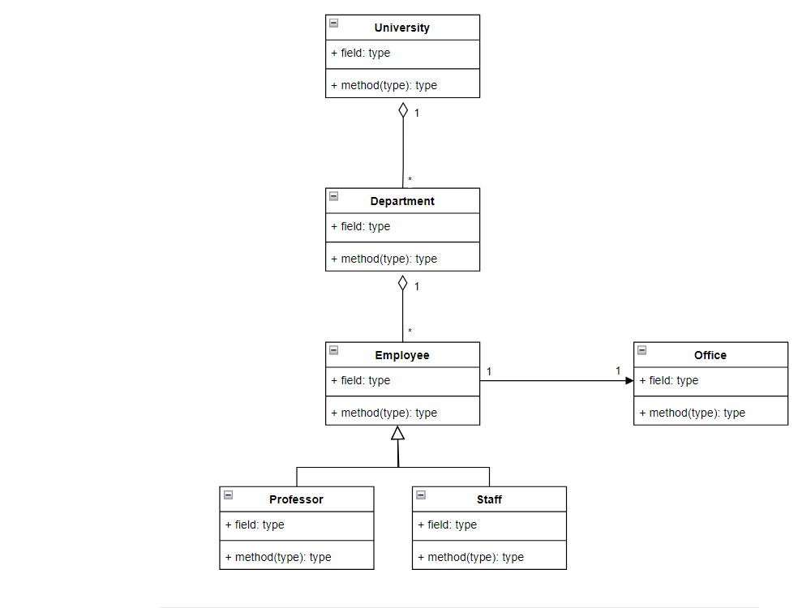

# UML Diagram Practice
## University Management System

**REQUIREMENTS**
1. There are classrooms, study offices and departments belonging to the university.
2. There are offices belonging to departments.
3. There are employees belonging to the university. These employees can be professors or civil servants.
4. Each employee works in an office.

Draw a Class diagram depicting this system.

Note: There is no need to specify the qualifications and behaviors of the classes.

**WORK**

