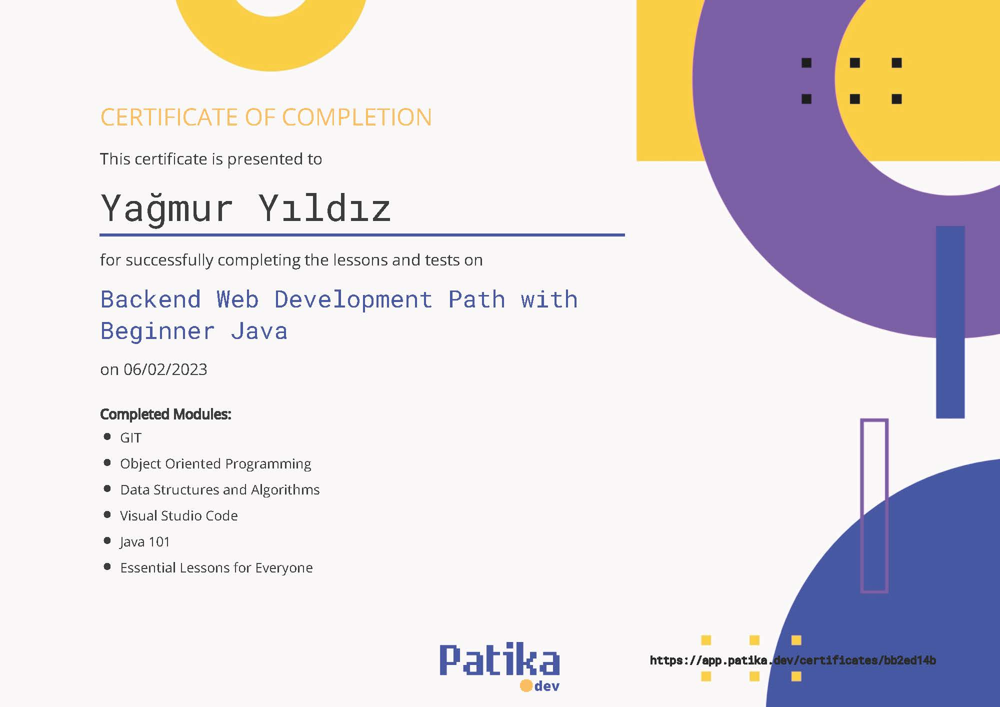

# Patika.dev Backend Development with Java | Beginner Path

### Completed Modules
 - **Essentials for Everyone**
 - **GIT 101**
 - **Visual Studio Code**
 - [**Data Structures and Algortihms**](.\01_DataStructuresAlgorithms)   
   - What is Algorithm
     - Analyzing an Algorithm, Time Complexity, Big-O-Notation
   - Data Structures
     - Array, Linked List, Hash Table
   - Sorting Algorithms
     - Insertion Sort, Selection Sort, Merge Sort, Quick Sort
   - Searching Algorithms   
     - Linear Search, Binary Search, Binary Search Tree
 - [**Java 101**](./02_Java101)
   - Introduction to Java
   - [Fundamentals of Java](./02_Java101/src/fundamentals)
     - Variables, Operators, Scanner 
   - [Conditions](./02_Java101/src/conditions)
     - Logic Operators, If-Else, Switch Case 
   - [Loops](./02_Java101/src/loops)
     - While, Do-While, For, Continue & Break comands
   - [Methods](./02_Java101/src/methods)
     - Methods, Return & Void, Overlaoging, Local Variables, Recursive Methods
   - [Classes](./02_Java101/src/Classes)
     - Creating Objects, Class Methods, Constructors
   - [Arrays](./02_Java101/src/Arrays)
     - Arrays, One-Dimension Arrays, Multi-Dimension Arrays, Arrays at Classes and Methods 
   - [Module Project: Mine Sweeper](./02_Java101/src/Project_MineSweeper)
 - [**Object Oriented Programming**](./OOP)